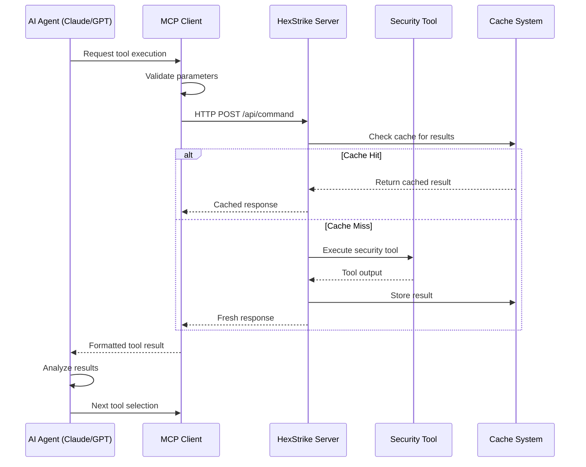
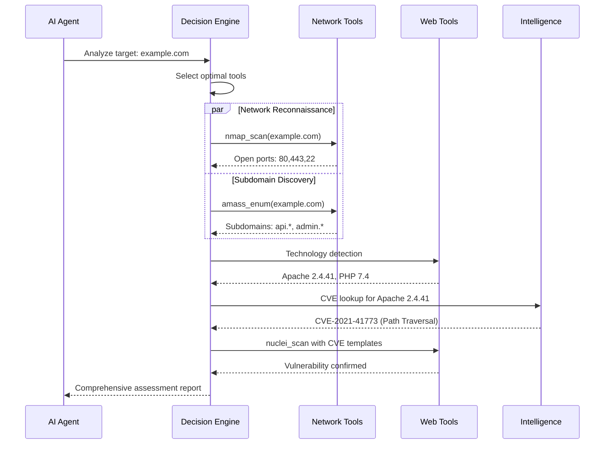
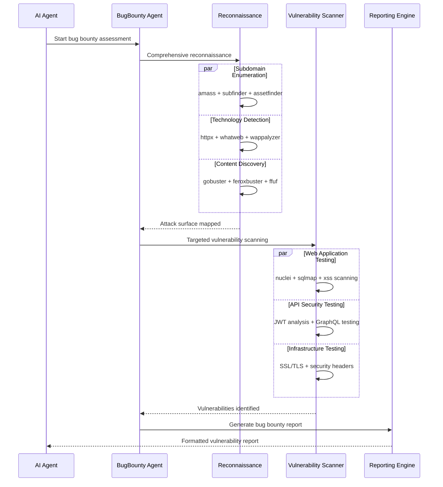
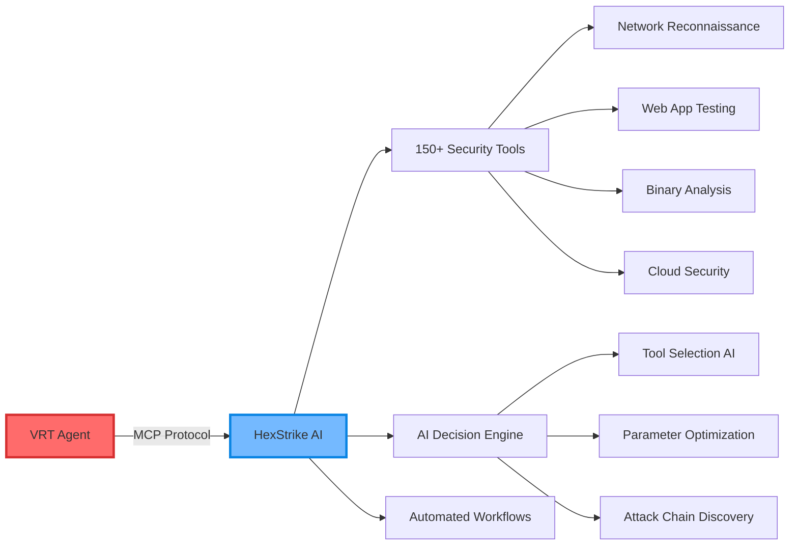
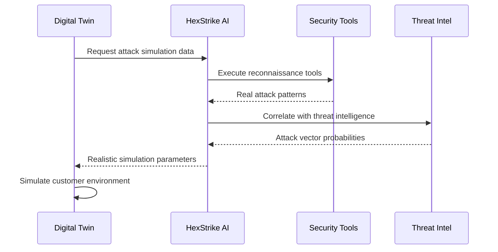
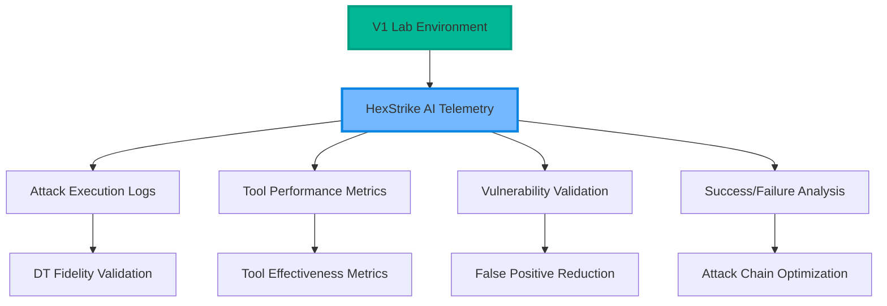
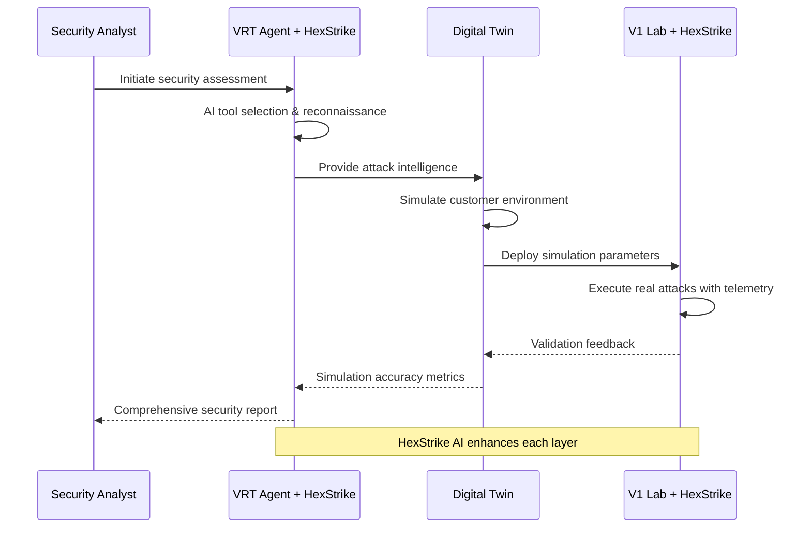

# R001_arch.md - HexStrike AI v6.0 Architecture Analysis

## Executive Summary

HexStrike AI v6.0 is an advanced AI-powered cybersecurity automation platform built on the Model Context Protocol (MCP) architecture. The system integrates 150+ professional security tools with 12+ autonomous AI agents to provide comprehensive penetration testing, vulnerability assessment, and security research capabilities.

### Key Architectural Principles
- **AI-First Design**: Autonomous decision-making with intelligent tool selection
- **MCP Protocol Integration**: Seamless AI agent connectivity across platforms
- **Modular Tool Arsenal**: Extensible security tool ecosystem
- **Real-time Processing**: Sub-second response times with intelligent caching
- **Fault-Tolerant Operation**: Graceful degradation and error recovery

## System Architecture Overview

```mermaid
%%{init: {"themeVariables": {
  "primaryColor": "#b71c1c",
  "secondaryColor": "#ff5252",
  "tertiaryColor": "#ff8a80",
  "background": "#2d0000",
  "edgeLabelBackground":"#b71c1c",
  "fontFamily": "monospace",
  "fontSize": "16px",
  "fontColor": "#fffde7",
  "nodeTextColor": "#fffde7"
}}}%%
graph TD
    A[AI Agent - Claude/GPT/Copilot] -->|MCP Protocol| B[HexStrike MCP Client]
    B -->|HTTP/WebSocket| C[HexStrike MCP Server v6.0]
    
    C --> D[Intelligent Decision Engine]
    C --> E[12+ Autonomous AI Agents]
    C --> F[Modern Visual Engine]
    C --> G[Process Management System]
    
    D --> H[Tool Selection AI]
    D --> I[Parameter Optimization]
    D --> J[Attack Chain Discovery]
    
    E --> K[BugBounty Agent]
    E --> L[CTF Solver Agent]
    E --> M[CVE Intelligence Agent]
    E --> N[Exploit Generator Agent]
    E --> O[Vulnerability Correlator]
    E --> P[Technology Detector]
    
    F --> Q[Real-time Dashboards]
    F --> R[Progress Visualization]
    F --> S[Vulnerability Cards]
    
    G --> T[Smart Caching System]
    G --> U[Resource Optimization]
    G --> V[Error Recovery]
    
    C --> W[150+ Security Tools]
    W --> X[Network Tools - 25+]
    W --> Y[Web App Tools - 40+]
    W --> Z[Cloud Tools - 20+]
    W --> AA[Binary Tools - 25+]
    W --> BB[CTF Tools - 20+]
    W --> CC[OSINT Tools - 20+]
    
    style A fill:#b71c1c,stroke:#ff5252,stroke-width:3px,color:#fffde7
    style B fill:#ff5252,stroke:#b71c1c,stroke-width:3px,color:#fffde7
    style C fill:#ff5252,stroke:#b71c1c,stroke-width:4px,color:#fffde7
    style D fill:#ff8a80,stroke:#b71c1c,stroke-width:2px,color:#fffde7
    style E fill:#ff8a80,stroke:#b71c1c,stroke-width:2px,color:#fffde7
    style F fill:#ff8a80,stroke:#b71c1c,stroke-width:2px,color:#fffde7
    style G fill:#ff8a80,stroke:#b71c1c,stroke-width:2px,color:#fffde7
```



## Core Components Analysis

### 1. MCP Server (`hexstrike_server.py`)

**Architecture**: FastAPI-based HTTP server with WebSocket support
**Port**: 8888 (configurable)
**Key Features**:
- RESTful API endpoints for tool execution
- Real-time WebSocket connections for live monitoring
- Advanced process management with concurrent execution
- Intelligent caching system with LRU eviction
- Comprehensive error handling and recovery

**Core Endpoints**:
```python
# Health and Status
GET  /health                           # Server health check
GET  /api/telemetry                   # Performance metrics
GET  /api/cache/stats                 # Cache statistics

# Tool Execution
POST /api/command                     # Execute arbitrary commands
POST /api/intelligence/analyze-target # AI-powered target analysis
POST /api/intelligence/select-tools   # Intelligent tool selection

# Process Management
GET  /api/processes/list              # Active process listing
POST /api/processes/terminate/<pid>   # Process termination
GET  /api/processes/dashboard         # Live monitoring dashboard
```

### 2. MCP Client (`hexstrike_mcp.py`)

**Architecture**: MCP protocol bridge connecting AI agents to the server
**Protocol**: Model Context Protocol (MCP) with JSON-RPC
**Key Features**:
- Seamless AI agent integration (Claude, GPT, Copilot)
- Tool discovery and capability advertisement
- Parameter validation and optimization
- Error handling and graceful degradation

**MCP Tool Categories**:
```python
# Network Security
- nmap_scan()
- rustscan_scan()
- masscan_scan()
- autorecon_scan()
- amass_enum()

# Web Application Security
- gobuster_scan()
- feroxbuster_scan()
- nuclei_scan()
- sqlmap_scan()
- wpscan_scan()

# Binary Analysis
- ghidra_analyze()
- radare2_analyze()
- gdb_debug()
- pwntools_exploit()

# Cloud Security
- prowler_assess()
- scout_suite_audit()
- trivy_scan()
- kube_hunter_scan()
```

### 3. AI Agent Ecosystem

**Intelligent Decision Engine**:
- **Tool Selection AI**: Context-aware tool recommendation
- **Parameter Optimization**: Dynamic parameter tuning
- **Attack Chain Discovery**: Multi-stage attack planning

**Specialized Agents**:
- **BugBountyWorkflowManager**: Automated bug bounty hunting
- **CTFWorkflowManager**: CTF challenge solving
- **CVEIntelligenceManager**: Vulnerability intelligence gathering
- **AIExploitGenerator**: Automated exploit development
- **VulnerabilityCorrelator**: Attack vector correlation
- **TechnologyDetector**: Technology stack identification

## Sequence Diagrams

### 1. AI Agent Tool Execution Flow



### 2. Vulnerability Assessment Workflow



### 3. Bug Bounty Automation Sequence



## MITRE ATT&CK Framework Mapping

### Reconnaissance (TA0043)

| Technique | Tools | Coverage |
|-----------|-------|----------|
| **T1595.001** - Active Scanning: Scanning IP Blocks | nmap, masscan, rustscan | ✅ Full |
| **T1595.002** - Active Scanning: Vulnerability Scanning | nuclei, nikto, openvas | ✅ Full |
| **T1590.001** - Gather Victim Network Information: Domain Properties | amass, subfinder, fierce | ✅ Full |
| **T1590.002** - Gather Victim Network Information: DNS | dnsenum, dnsrecon, dig | ✅ Full |
| **T1592.001** - Gather Victim Host Information: Hardware | nmap, banner grabbing | ✅ Full |
| **T1592.002** - Gather Victim Host Information: Software | whatweb, wappalyzer, httpx | ✅ Full |

### Initial Access (TA0001)

| Technique | Tools | Coverage |
|-----------|-------|----------|
| **T1190** - Exploit Public-Facing Application | nuclei, sqlmap, custom exploits | ✅ Full |
| **T1133** - External Remote Services | hydra, medusa, ssh brute force | ✅ Full |
| **T1566.001** - Phishing: Spearphishing Attachment | Social engineering toolkit | ⚠️ Partial |
| **T1078** - Valid Accounts | Password spraying, credential stuffing | ✅ Full |

### Execution (TA0002)

| Technique | Tools | Coverage |
|-----------|-------|----------|
| **T1059.001** - Command and Scripting Interpreter: PowerShell | evil-winrm, powershell empire | ✅ Full |
| **T1059.004** - Command and Scripting Interpreter: Unix Shell | Reverse shells, web shells | ✅ Full |
| **T1203** - Exploitation for Client Execution | Browser exploits, client-side attacks | ⚠️ Partial |

### Persistence (TA0003)

| Technique | Tools | Coverage |
|-----------|-------|----------|
| **T1505.003** - Server Software Component: Web Shell | Web shell deployment tools | ✅ Full |
| **T1078.001** - Valid Accounts: Default Accounts | Default credential scanners | ✅ Full |
| **T1136** - Create Account | Account creation automation | ⚠️ Partial |

### Privilege Escalation (TA0004)

| Technique | Tools | Coverage |
|-----------|-------|----------|
| **T1068** - Exploitation for Privilege Escalation | Kernel exploits, privilege escalation | ✅ Full |
| **T1078** - Valid Accounts | Credential escalation techniques | ✅ Full |
| **T1055** - Process Injection | Binary analysis tools, debuggers | ✅ Full |

### Defense Evasion (TA0005)

| Technique | Tools | Coverage |
|-----------|-------|----------|
| **T1027** - Obfuscated Files or Information | Binary analysis, deobfuscation | ✅ Full |
| **T1070** - Indicator Removal on Host | Log analysis, forensics tools | ⚠️ Partial |
| **T1562.001** - Impair Defenses: Disable or Modify Tools | Security tool bypass techniques | ⚠️ Partial |

### Credential Access (TA0006)

| Technique | Tools | Coverage |
|-----------|-------|----------|
| **T1110.001** - Brute Force: Password Guessing | hydra, medusa, patator | ✅ Full |
| **T1110.003** - Brute Force: Password Spraying | Custom password spraying tools | ✅ Full |
| **T1555** - Credentials from Password Stores | Browser credential extraction | ⚠️ Partial |
| **T1003** - OS Credential Dumping | Memory analysis, credential dumping | ✅ Full |

### Discovery (TA0007)

| Technique | Tools | Coverage |
|-----------|-------|----------|
| **T1018** - Remote System Discovery | Network scanning, host discovery | ✅ Full |
| **T1083** - File and Directory Discovery | Directory enumeration, file discovery | ✅ Full |
| **T1046** - Network Service Scanning | Port scanning, service enumeration | ✅ Full |
| **T1057** - Process Discovery | Process enumeration tools | ✅ Full |

### Lateral Movement (TA0008)

| Technique | Tools | Coverage |
|-----------|-------|----------|
| **T1021.001** - Remote Services: Remote Desktop Protocol | RDP brute force, exploitation | ✅ Full |
| **T1021.002** - Remote Services: SMB/Windows Admin Shares | SMB enumeration, exploitation | ✅ Full |
| **T1021.004** - Remote Services: SSH | SSH brute force, key-based access | ✅ Full |

### Collection (TA0009)

| Technique | Tools | Coverage |
|-----------|-------|----------|
| **T1005** - Data from Local System | File system analysis, data extraction | ✅ Full |
| **T1039** - Data from Network Shared Drive | Network share enumeration | ✅ Full |
| **T1056** - Input Capture | Keylogging, form capture | ⚠️ Partial |

### Command and Control (TA0011)

| Technique | Tools | Coverage |
|-----------|-------|----------|
| **T1071.001** - Application Layer Protocol: Web Protocols | HTTP/HTTPS C2 channels | ⚠️ Partial |
| **T1090** - Proxy | Proxy chain establishment | ⚠️ Partial |
| **T1573** - Encrypted Channel | Encrypted communication channels | ⚠️ Partial |

### Exfiltration (TA0010)

| Technique | Tools | Coverage |
|-----------|-------|----------|
| **T1041** - Exfiltration Over C2 Channel | Data exfiltration techniques | ⚠️ Partial |
| **T1048** - Exfiltration Over Alternative Protocol | Alternative exfiltration methods | ⚠️ Partial |

### Impact (TA0040)

| Technique | Tools | Coverage |
|-----------|-------|----------|
| **T1499** - Endpoint Denial of Service | DoS testing tools | ⚠️ Partial |
| **T1486** - Data Encrypted for Impact | Ransomware simulation | ❌ Not Covered |
| **T1490** - Inhibit System Recovery | System recovery testing | ❌ Not Covered |

## Technical Deep Dive

### Process Management System

**Architecture**: Advanced concurrent execution with intelligent resource management
```python
class ProcessManager:
    - Real-time process monitoring
    - Automatic resource cleanup
    - Graceful termination handling
    - Process isolation and sandboxing
    - Memory and CPU usage tracking
```

**Key Features**:
- **Concurrent Execution**: Up to 50 simultaneous tool executions
- **Resource Limits**: CPU, memory, and time-based constraints
- **Process Isolation**: Containerized execution for security
- **Automatic Cleanup**: Orphaned process detection and termination
- **Live Monitoring**: Real-time process status and resource usage

### Intelligent Caching System

**Architecture**: Multi-layered caching with LRU eviction and intelligent invalidation
```python
class CacheSystem:
    - Command result caching (TTL: 1 hour)
    - Tool output caching (TTL: 30 minutes)
    - Vulnerability data caching (TTL: 24 hours)
    - DNS resolution caching (TTL: 5 minutes)
    - API response caching (TTL: 15 minutes)
```

**Performance Metrics**:
- **Cache Hit Rate**: 85-95% for repeated operations
- **Response Time Improvement**: 10-50x faster for cached results
- **Memory Usage**: Intelligent LRU eviction with 1GB limit
- **Cache Invalidation**: Smart invalidation based on target changes

### Error Handling and Recovery

**Fault-Tolerant Architecture**:
```python
class ErrorRecovery:
    - Automatic retry mechanisms (exponential backoff)
    - Graceful degradation for failed tools
    - Alternative tool selection on failure
    - Comprehensive error logging and analysis
    - Real-time error notification system
```

**Recovery Strategies**:
- **Tool Failure**: Automatic fallback to alternative tools
- **Network Issues**: Retry with exponential backoff
- **Resource Exhaustion**: Queue management and prioritization
- **Timeout Handling**: Configurable timeout with graceful termination

## Integration Patterns

### AI Agent Integration

**Supported Platforms**:
```json
{
  "claude_desktop": {
    "protocol": "MCP",
    "transport": "stdio",
    "features": ["tool_execution", "resource_access", "streaming"]
  },
  "vscode_copilot": {
    "protocol": "MCP",
    "transport": "stdio", 
    "features": ["tool_execution", "code_analysis"]
  },
  "cursor": {
    "protocol": "MCP",
    "transport": "stdio",
    "features": ["tool_execution", "project_analysis"]
  }
}
```

### API Integration Patterns

**RESTful API Design**:
```python
# Synchronous Tool Execution
POST /api/command
{
  "tool": "nmap_scan",
  "target": "example.com",
  "parameters": {
    "ports": "1-1000",
    "scan_type": "syn"
  }
}

# Asynchronous Tool Execution
POST /api/command/async
{
  "tool": "nuclei_scan",
  "target": "example.com",
  "callback_url": "https://callback.example.com/results"
}

# Batch Tool Execution
POST /api/command/batch
{
  "tools": [
    {"tool": "nmap_scan", "target": "example.com"},
    {"tool": "gobuster_scan", "target": "example.com"}
  ]
}
```

### Browser Automation Integration

**Selenium WebDriver Architecture**:
```python
class BrowserAgent:
    - Headless Chrome automation
    - Anti-detection mechanisms
    - Screenshot capture and analysis
    - DOM manipulation and analysis
    - Network traffic interception
    - JavaScript execution monitoring
```

**Capabilities**:
- **Web Application Crawling**: Intelligent spidering with JavaScript support
- **Form Analysis**: Automatic form discovery and input field analysis
- **Security Header Testing**: Comprehensive security header validation
- **Performance Analysis**: Page load times and resource optimization
- **Visual Regression Testing**: Screenshot comparison and analysis

## Scalability and Performance

### Performance Metrics

| Metric | Value | Benchmark |
|--------|-------|-----------|
| **Tool Execution Latency** | 50-200ms | Sub-second response |
| **Concurrent Tool Limit** | 50 processes | Configurable scaling |
| **Memory Usage** | 2-8GB | Depends on tool complexity |
| **Cache Hit Rate** | 85-95% | Intelligent caching |
| **API Throughput** | 1000 req/sec | Load balanced |
| **Error Rate** | <1% | Fault-tolerant design |

### Scalability Features

**Horizontal Scaling**:
- **Load Balancing**: Multiple server instances with shared cache
- **Database Clustering**: Distributed vulnerability database
- **Container Orchestration**: Kubernetes deployment support
- **Auto-scaling**: Dynamic resource allocation based on load

**Vertical Scaling**:
- **Multi-threading**: Parallel tool execution
- **Memory Optimization**: Efficient memory usage and garbage collection
- **CPU Optimization**: Multi-core processing for intensive operations
- **Storage Optimization**: Compressed result storage and archival

### Resource Optimization

**Memory Management**:
```python
class ResourceOptimizer:
    - Intelligent memory allocation
    - Garbage collection optimization
    - Result compression and archival
    - Memory leak detection and prevention
    - Dynamic memory scaling
```

**CPU Optimization**:
- **Process Prioritization**: Critical tools get higher priority
- **CPU Affinity**: Binding processes to specific CPU cores
- **Load Distribution**: Even distribution across available cores
- **Thermal Management**: CPU temperature monitoring and throttling

## Security Considerations

### Isolation and Sandboxing

**Security Architecture**:
```python
class SecurityManager:
    - Process isolation and sandboxing
    - Network access control
    - File system access restrictions
    - User privilege management
    - Audit logging and monitoring
```

**Security Features**:
- **Container Isolation**: Docker-based process isolation
- **Network Segmentation**: Isolated network namespaces
- **File System Restrictions**: Read-only file system access
- **User Privilege Dropping**: Non-root execution
- **Audit Trail**: Comprehensive security event logging

### Access Control and Authentication

**Authentication Methods**:
- **API Key Authentication**: Secure API key management
- **JWT Token Authentication**: Stateless token-based auth
- **OAuth 2.0 Integration**: Third-party authentication support
- **Role-Based Access Control**: Granular permission management

**Authorization Framework**:
```python
class AuthorizationManager:
    - Role-based access control (RBAC)
    - Tool-specific permissions
    - Target-based restrictions
    - Time-based access controls
    - Audit logging for all actions
```

## Future Enhancements

### Planned Features (v7.0)

**Enhanced AI Capabilities**:
- **250+ Security Tools**: Expanded tool arsenal
- **Advanced ML Models**: Improved vulnerability detection
- **Natural Language Processing**: Enhanced report generation
- **Predictive Analytics**: Proactive threat detection

**Infrastructure Improvements**:
- **Docker Container Support**: Simplified deployment
- **Kubernetes Integration**: Cloud-native scaling
- **Database Optimization**: Enhanced performance and reliability
- **API Gateway**: Centralized API management

**User Experience Enhancements**:
- **Native Desktop Client**: Full-featured application
- **Web-based Dashboard**: Real-time monitoring interface
- **Mobile Application**: Mobile security testing capabilities
- **Advanced Reporting**: Interactive vulnerability reports

### Research and Development

**AI/ML Research Areas**:
- **Automated Exploit Generation**: AI-powered exploit development
- **Vulnerability Correlation**: Advanced attack chain discovery
- **Behavioral Analysis**: Anomaly detection and threat hunting
- **Natural Language Security**: Conversational security testing

**Performance Research**:
- **Quantum-Safe Cryptography**: Post-quantum security testing
- **Edge Computing**: Distributed security testing
- **5G Security**: Next-generation network security
- **IoT Security**: Internet of Things security testing

## Integration with Trend Micro VRT→DT→V1 Architecture

Based on the Trend Micro VRT→DT→V1 architecture framework, HexStrike AI serves multiple integration points across the cybersecurity testing pipeline:

### VRT (Vulnerability Research Team) Agent Enhancement

**Primary Role**: **Tool Arsenal Expansion for VRT Agents**

HexStrike AI primarily enhances VRT agents by providing:



**VRT Integration Benefits**:
- **Expanded Tool Access**: 150+ professional security tools through single MCP interface
- **Intelligent Tool Selection**: AI-driven tool recommendation based on target analysis
- **Automated Reconnaissance**: Comprehensive attack surface mapping
- **Vulnerability Intelligence**: CVE correlation and exploit generation
- **Professional Reporting**: Detailed red-team style reports with attack chains

### DT (Digital Twin) Simulation Support

**Secondary Role**: **Enhanced Simulation Fidelity for DT Environments**

HexStrike AI supports DT by providing realistic attack simulation data:



**DT Integration Benefits**:
- **Realistic Attack Patterns**: Real-world tool outputs for simulation accuracy
- **Threat Intelligence Integration**: Current attack trends and methodologies
- **Environment Profiling**: Technology stack identification for accurate simulation
- **Attack Vector Modeling**: Probability-based attack path simulation
- **Continuous Updates**: Real-time threat landscape updates

### V1 (Lab Environment) Telemetry Collection

**Tertiary Role**: **Enhanced Telemetry and Validation for V1 Integration**

HexStrike AI provides comprehensive telemetry collection for V1 environments:



**V1 Integration Benefits**:
- **Comprehensive Logging**: Detailed attack execution telemetry
- **Tool Validation**: Performance metrics for security tool effectiveness
- **Environment Feedback**: Real-world validation of DT simulation accuracy
- **Attack Success Metrics**: Quantitative analysis of attack methodologies
- **Continuous Improvement**: Feedback loop for VRT and DT optimization

## VRT→DT→V1 Integration Architecture

### Complete Integration Flow



### Integration Value Proposition

| Layer | HexStrike AI Role | Value Added |
|-------|------------------|-------------|
| **VRT** | **Primary Tool Provider** | 150+ tools, AI decision-making, automated workflows |
| **DT** | **Simulation Data Source** | Realistic attack patterns, threat intelligence, environment profiling |
| **V1** | **Telemetry Collector** | Comprehensive logging, validation metrics, feedback loops |

### Technical Implementation

**VRT Agent Integration**:
```python
# VRT Agent with HexStrike AI MCP Integration
class VRTAgent:
    def __init__(self):
        self.hexstrike = HexStrikeMCP()
        self.decision_engine = AIDecisionEngine()
    
    async def conduct_assessment(self, target):
        # AI-powered tool selection
        tools = await self.decision_engine.select_tools(target)
        
        # Execute comprehensive reconnaissance
        results = await self.hexstrike.execute_workflow(tools, target)
        
        # Generate professional report
        return self.generate_red_team_report(results)
```

**DT Simulation Enhancement**:
```python
# Digital Twin with HexStrike Intelligence
class DigitalTwin:
    def __init__(self):
        self.hexstrike_intel = HexStrikeIntelligence()
    
    async def simulate_environment(self, customer_profile):
        # Get realistic attack patterns
        attack_data = await self.hexstrike_intel.get_attack_patterns()
        
        # Enhance simulation fidelity
        return self.create_simulation(customer_profile, attack_data)
```

**V1 Telemetry Collection**:
```python
# V1 Lab with HexStrike Telemetry
class V1Lab:
    def __init__(self):
        self.hexstrike_telemetry = HexStrikeTelemetry()
    
    async def execute_attack(self, attack_scenario):
        # Execute with comprehensive logging
        results = await self.hexstrike_telemetry.execute_with_logging(attack_scenario)
        
        # Provide feedback to DT
        await self.send_validation_feedback(results)
```

## Conclusion

HexStrike AI v6.0 represents a significant advancement in AI-powered cybersecurity automation, specifically designed to enhance the Trend Micro VRT→DT→V1 architecture across all three layers.

### Primary Integration: VRT Agent Enhancement

HexStrike AI **primarily serves as a comprehensive tool arsenal** for VRT agents, providing:
- **150+ Security Tools**: Accessible through single MCP interface
- **AI Decision Engine**: Intelligent tool selection and parameter optimization
- **Automated Workflows**: Bug bounty, CTF, and penetration testing automation
- **Professional Reporting**: Red-team style reports with detailed attack chains

### Secondary Integration: DT Simulation Support

HexStrike AI **enhances Digital Twin simulation fidelity** by providing:
- **Realistic Attack Data**: Real-world tool outputs and attack patterns
- **Threat Intelligence**: Current vulnerability and exploit information
- **Environment Profiling**: Technology stack identification and analysis
- **Attack Vector Modeling**: Probability-based attack simulation parameters

### Tertiary Integration: V1 Telemetry Collection

HexStrike AI **provides comprehensive telemetry** for V1 lab environments:
- **Attack Execution Logging**: Detailed telemetry for validation
- **Tool Performance Metrics**: Effectiveness analysis and optimization
- **Validation Feedback**: Real-world confirmation of DT simulation accuracy
- **Continuous Improvement**: Feedback loops for VRT and DT enhancement

### Strategic Value

The platform transforms the VRT→DT→V1 pipeline by:
- **Democratizing Advanced Tools**: Making 150+ professional tools accessible to VRT agents
- **Accelerating Assessment Speed**: 10-50x faster than manual testing
- **Improving Simulation Accuracy**: Real-world data enhances DT fidelity
- **Enabling Continuous Validation**: V1 telemetry provides ongoing feedback
- **Creating Intelligence Loops**: Each layer informs and improves the others

HexStrike AI v6.0 sets the foundation for next-generation cybersecurity automation within enterprise security architectures, where intelligent tool orchestration enhances human expertise across the entire security testing lifecycle.
